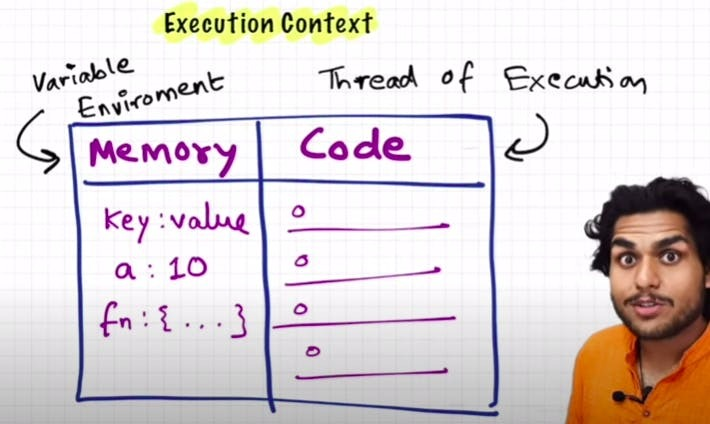

# **Execution Context**

- Everything in JS happens inside the execution context. Imagine a sealed-off container inside which JS runs.
  It is an abstract concept that hold info about the env. within the current code is being executed.
  

- In the container the first component is **memory component** and the 2nd one is **code component**

- In **Memory component**, all the variables and functions are Stored in key value pairs. It is also called **Variable environment**.

- in **Code component**, code is executed one line at a time. It is also called **the Thread of Execution**.

- JS is a **synchronous**, **single-threaded** language
  - Synchronous:- In a specific synchronous order.
  - Single-threaded:- One command at a time.

